# Working with Malcolm 

## 1. Open the Malcolm welcome page
Open the Malcolm Webpage through the link you found before on the terminal server and log in with those Login information’s. (File on terminal Server: `C:\Users\Public\Documents\Remote_Access_Quick_Reference.txt`)

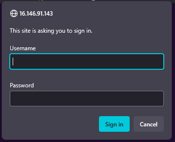

From this Landing page you can navigate to all the Tools Malcolm is using and to all we will using here in the workshop. (NetBox, OpenSearch Dashboards and Arkime) 
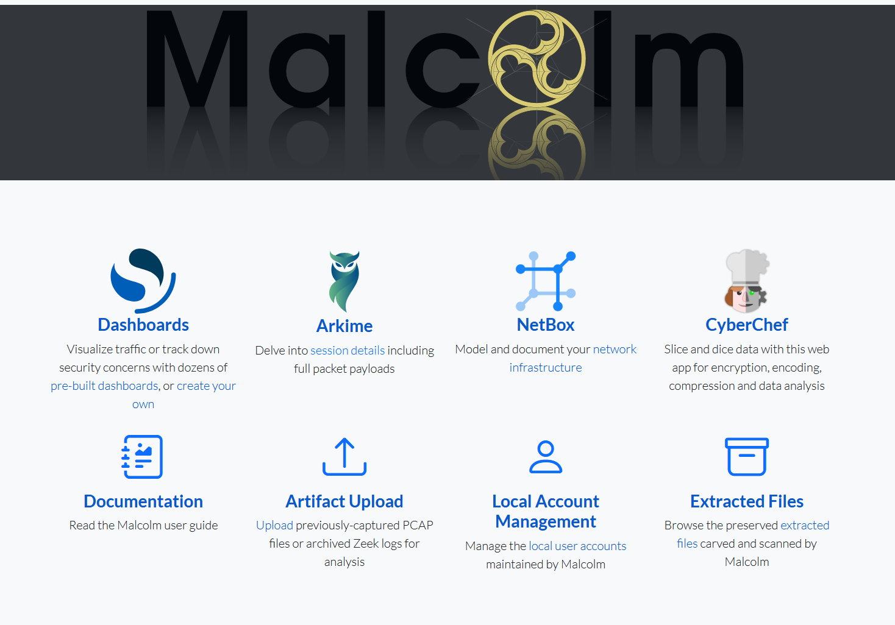

## 2. Network Inventory 
First, we want to go into the Inventory Manager NetBox. Here we want to define the names and the connected IPs of the servers, this does make it simpler for the analysis later, when we can connect the IPs at every time to the Servers without having to remember the IPs. 
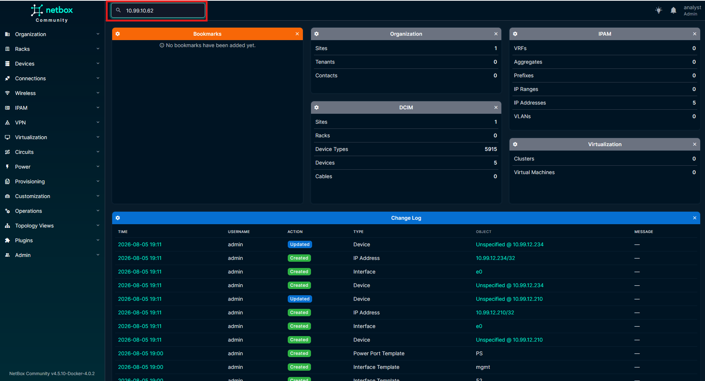

### 2.1. Finding the Terminal Server 
Search for the Private IP of the Terminal Server, Internet facing. Select the device. 
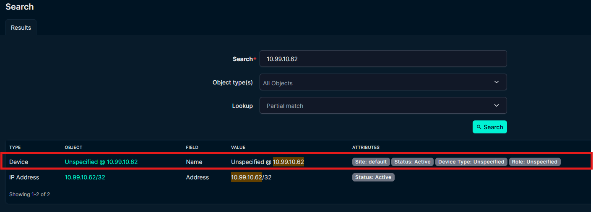

1. Now we hit edit to change the information. 
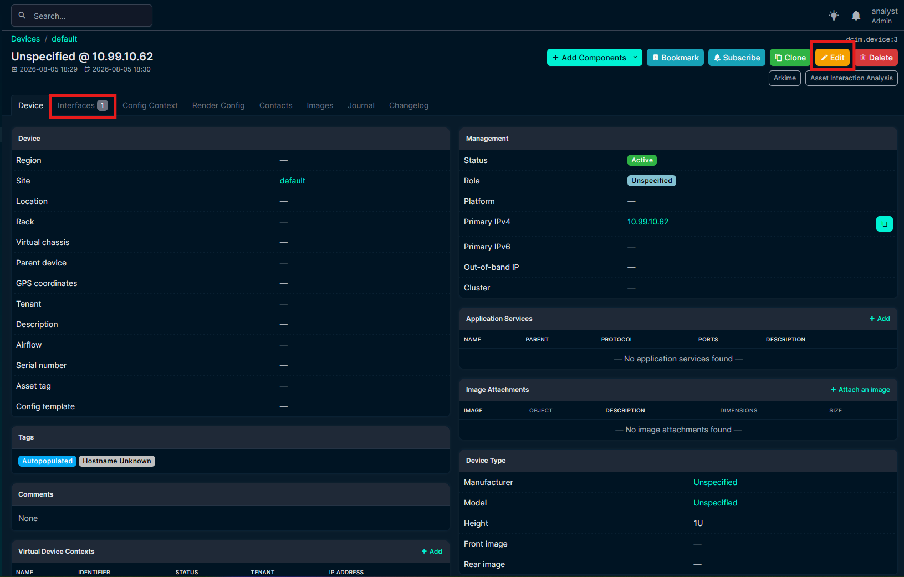

2. Change the name and save. 
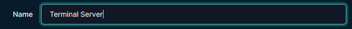

3. Switch to the Interface section and edit the current Instance. 
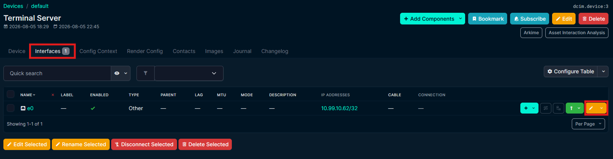

4. Change the Name form `e0` to `WAN` and save. 
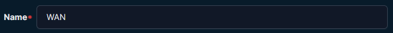

5. Create a new Interface and name it `Terminal Highway` and set the type to `other`. 
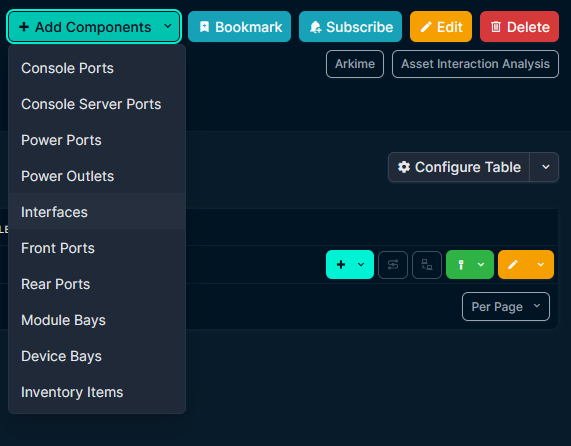

6. Add the IP Address to the Interface. Paste the IP with the subnet in. Example: `10.99.13.167/32`. 
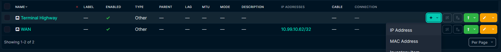

### 2.2. Find the Application Server 
Do the exact same thing here for the Application server then we done for the Terminal Server just with the different IPs. 

### 2.3. Find the PLC 
Because the PLC Does have only one Interface, we only have to change the Name of the PLC and the Interface, we don't have to add another one. 

Now we have alle Devices with device name, IPs in the system and connected to the Networks. 

## 3. OpenSearch Dashboard
When we go back to the [landing page](#1-open-the-malcolm-welcome-page) and open the Dashboard, the fist Dashboard you will see is the Overview, here you see the menu with all the Dashboards Malcolm is coming with and a nice overview of the network traffic in general. 
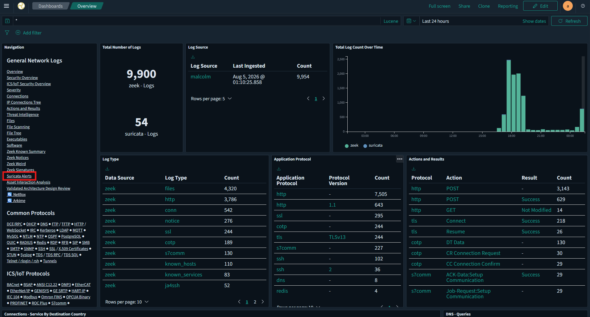

## 4. Suricata Alerts 
In the menu you can find the Suricata Alert dashboard, there you can see the Events that Triggered the rules we just talked about. - Scroll down a bit until you can see the Altert"s. 
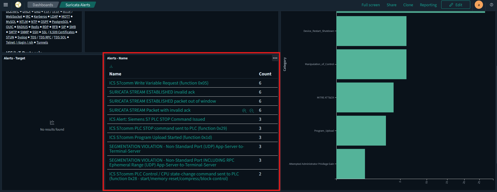

Here you can find the alert that got triggert by the s7 Stop command we send earlier. 
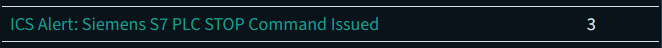

With a Click on the alert we get redirected to Arkime where we can take a more detailed look at the Traffic and find out where it came from. 

## 5. Where did the s7 stop command come from? 
Arkime is a powerful tool to inspect network traffic in detail. 
Because we come from OpenSearch, the traffic is prefiltered for the Suricata alert. That makes it easy for us to find the information's what the alert triggert. 
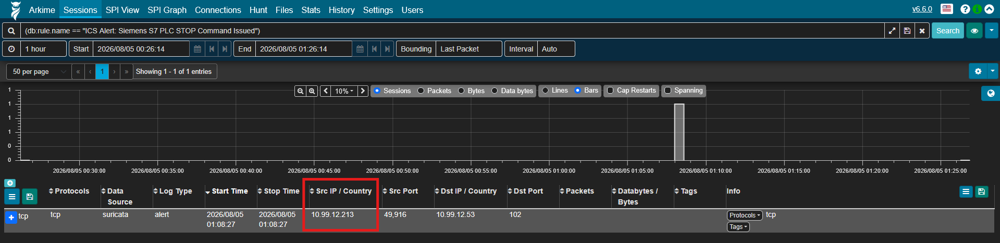

    ❗Important: make sure the filter time is long enough. Change the default from 1 hour to 24 hours

Because we know now exactly what we are looking for, we cant create our own filter to find the exact PLC stop command. For this we will filter by the source IP (Application Server), destination IP (PLC), protocol (s7comm) and the s7comm function (PLC Stop): 
`ip.src == 10.99.12.213 && ip.dst == 10.99.12.53 && protocols == s7comm && zeek.s7comm.function_name == "PLC Stop"`

When you expand the conversation (`+` on the left side) you can see all the Information connected to this single network signal. Protocols, Port, NetBox information's, protocol details. 
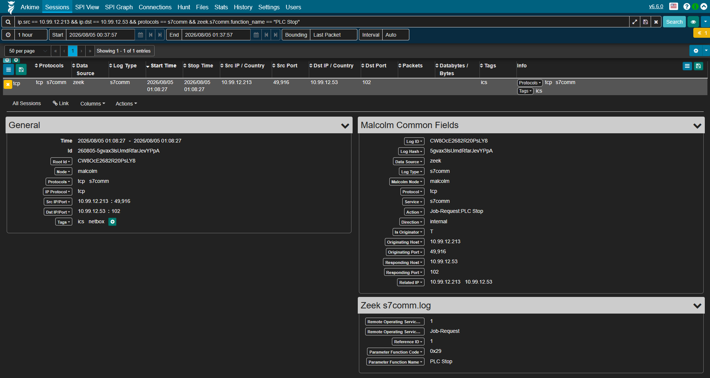

Because we just changed the name in NetBox a few minutes ago, here in Arkime is still the old name. That’s why we go back to the NetBox UI and searching for the IPs to see which device its coming from. 

## 6. Further Hunting
We know now from which server the Turbine got stopped. The Question is still, from where the attack came from and how was it done. 
For further investigations we are going back to the Suricata alert dashboard ([Suricata alerts](#4-suricata-alerts)). 
Here we can see another alert that got triggered. The SSH Dictionary attack we done at the very beginning today. That triggered the rule of more then 5 wrong ssh authentications to one device in 5 min. 
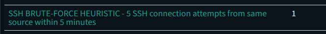

We could do the same here as earlier and jump form here in to Arkime, this time we open Arkime in a new window from the [landing page](#1-open-the-malcolm-welcome-page) and go to the connections page. Filter for the ssh traffic (`protocols == ssh`) and set the time to `24 hours`. 
For here we can walk backwarts and see, which IP sshd into the Application server (the separated connection, in the bottom right).  
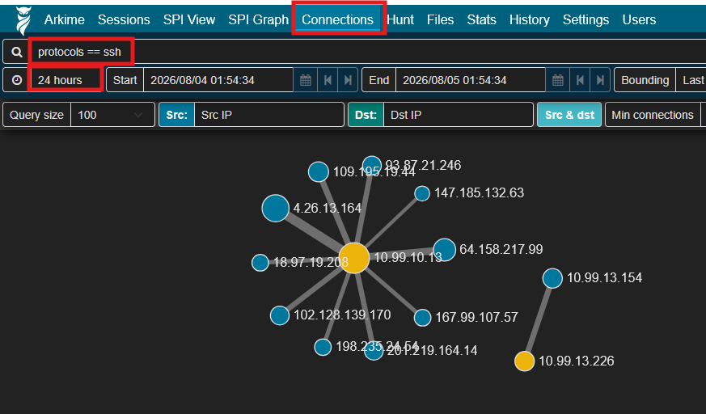

Because we defined everything, we can compare the Arkime data now with the inventory and see exactly with devices talked to each other. 
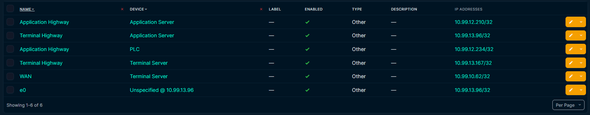

## 7. protocol specific default Dashboard
To have more insights into the ssh traffic, we can open one of the many protocol specific OpenSearch Dashboards. As marked in the screenshot, you can see the IP, where the most ssh connections are coming from. Thats the source of the Dictionary attack. 
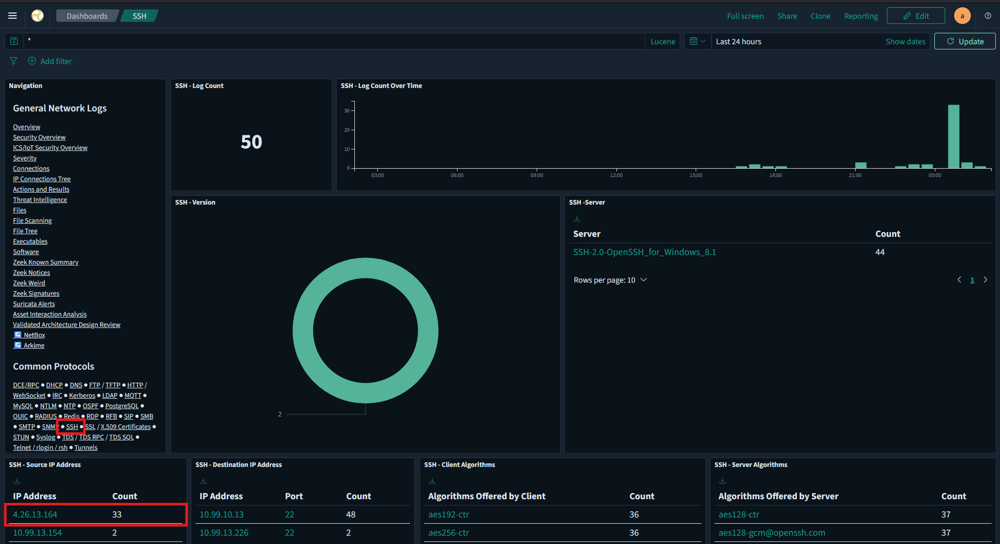

## 8. Crate own OpenSearch Dashboard 
We start simple, with cloning the Overview Dashboard. 
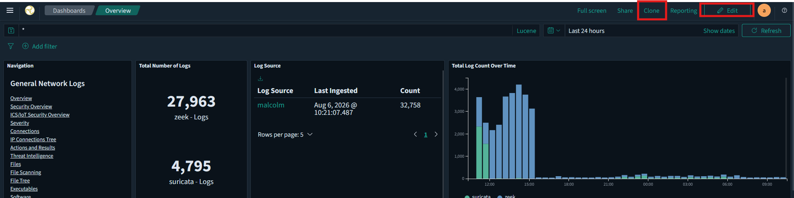

Rename your dashboard and continue, you should see the name of the dashboard in the top left changed. 

Enable the Edit mode in the top right. For a simple fist experience we want to add the SSH source IP table that you can find on the ssh Dashboard. 

Click on `Add` search for `ssh` and select the `SSH - Source IP Adress`. The panel was added. 
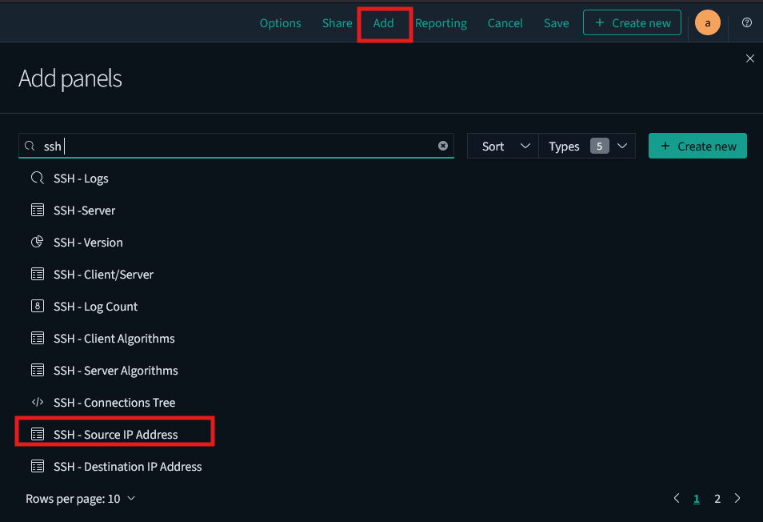

Now scrolle down the on to the bottom of the dashboard, there you find the just added diagram. Move it via Drag and drop to the place where you want it to be. Re size it form the bottom right corner. 
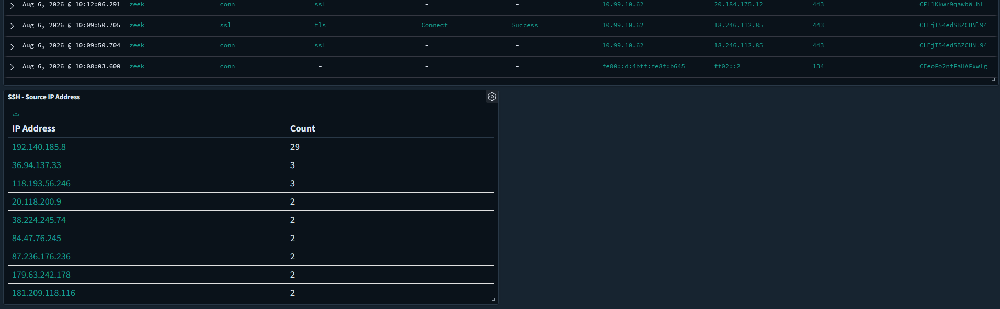

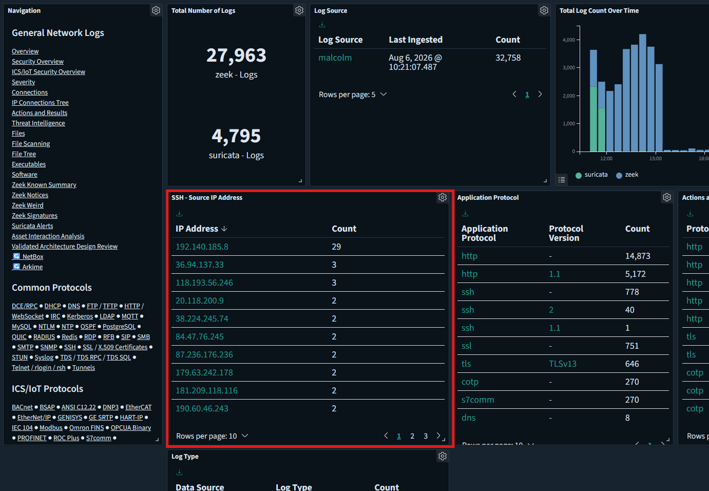

Now have fun and create your onw personal dashboard. 

    ❗Important: Don't forget to save when your are done. (upper right corner) 